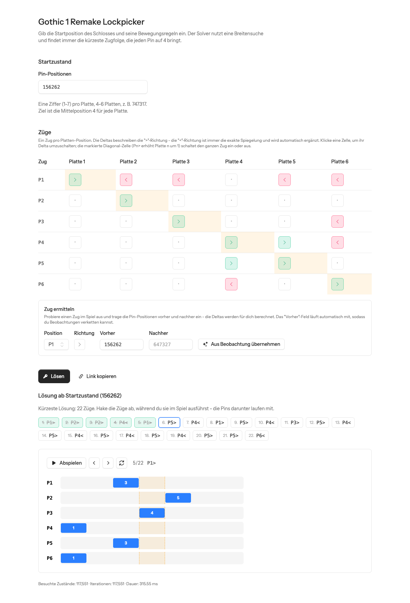

# g1rl — Gothic 1 Remake Lockpicker

[](https://github.com/ThomasEnssner/g1rl/actions/workflows/tests.yml)
[](https://github.com/ThomasEnssner/g1rl/actions/workflows/lint.yml)
[](LICENSE)

An open source solver for the lockpicking mini game in **Gothic 1 Remake**.
Enter the start position of a lock and its movement rules — the solver runs a
breadth first search and always finds the **mathematically shortest** sequence
of moves that opens the lock.

**Try it live: [g1r-lock.laravel.cloud](https://g1r-lock.laravel.cloud/)**



*The UI follows your browser language — English and German are included.*

## The game model

- A lock has **4–7 plates**. Every plate sits in one of **7 positions** (1–7).
- The lock opens when **every plate is at the middle position 4**.
- Each pick position `Pn` can be pushed right (`Pn>`) or left (`Pn<`):
  - `Pn>` always raises plate *n* itself by exactly 1 and may shift other
    plates by −1, 0 or +1 at the same time.
  - `Pn<` is always the exact mirror of `Pn>`.
- A move that would push any plate below 1 or above 7 is invalid.

## Features

- **Guaranteed shortest solution** — iterative breadth first search over the
  state space, duplicate states are visited only once.
- **Move discovery** — you don't need to know the deltas. Try a move in the
  game, enter the pin positions before and after, and the deltas are computed
  for you. The "before" field follows along so observations can be chained,
  and the next position/direction is suggested automatically.
- **Plausibility checks** — observations and manual edits are rejected when
  they violate the game's rules (e.g. `P3<` must lower plate 3 by exactly 1).
- **Playback animation** — step through the solution and watch the plates
  slide into the target zone.
- **Shareable locks** — the whole lock definition lives in the URL:
  [`/?lock=156262~200100~121111~112110~111220~111221~111012`](https://g1r-lock.laravel.cloud/?lock=156262~200100~121111~112110~111220~111221~111012)
  (a real difficulty 4 lock from the game — the solver opens it in 22 moves)
- **Statistics** — visited states, iterations and solver duration.

## Development

Requirements: PHP 8.4+, Composer, Node 22+.

```bash
git clone https://github.com/ThomasEnssner/g1rl.git
cd g1rl
composer setup     # install, .env, app key, migrate, npm install + build
composer run dev   # serve with vite hot reload
```

Run the test suite:

```bash
php artisan test
```

Static analysis and code style:

```bash
composer types:check
composer lint
```

## Architecture

The solver is **pure, framework-independent PHP** in [`app/Gothic`](app/Gothic):

| Class | Responsibility |
|---|---|
| `State` | Immutable pin positions, `apply()`, `hash()`, `isSolved()` |
| `Move` | Named move with one delta per plate, `inverted()`, `fromObservation()` |
| `Lock` | Start state + available moves |
| `Solver` | Iterative BFS, shortest path guaranteed |
| `Solution` | Path, statistics, `replay()` for the animation |
| `LockCodec` | Serializes a lock definition to the URL-safe share format |

The UI is a single Livewire page component
([`resources/views/pages/⚡lock-picker.blade.php`](resources/views/pages/%E2%9A%A1lock-picker.blade.php))
built with [Flux UI](https://fluxui.dev) and Tailwind CSS. Solving needs no
database — everything happens in memory.

## License

[MIT](LICENSE)
